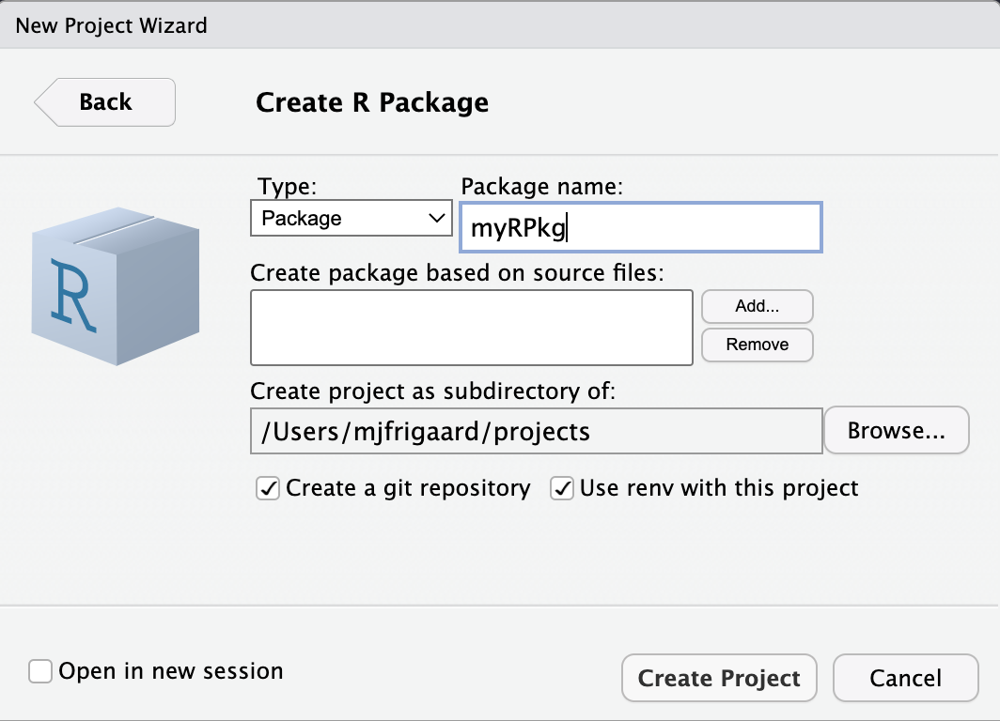
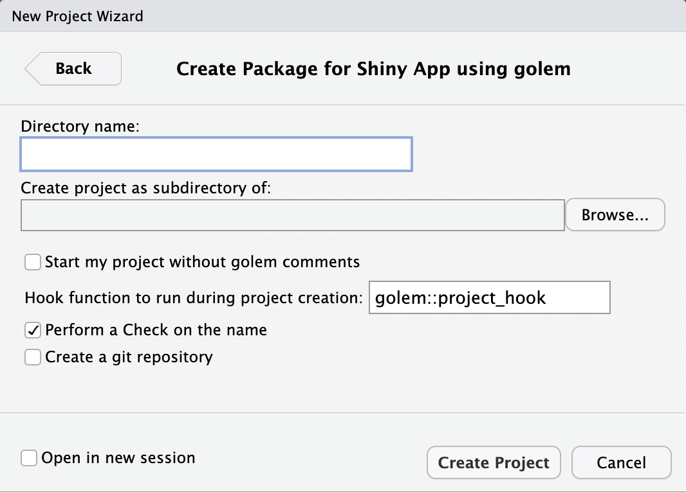
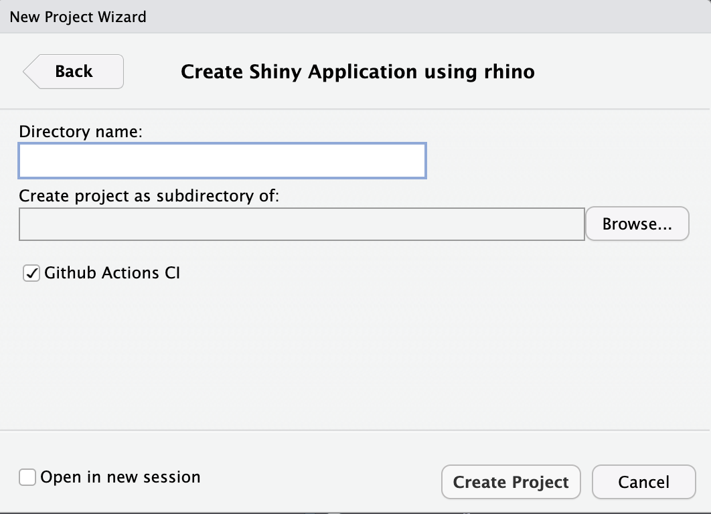
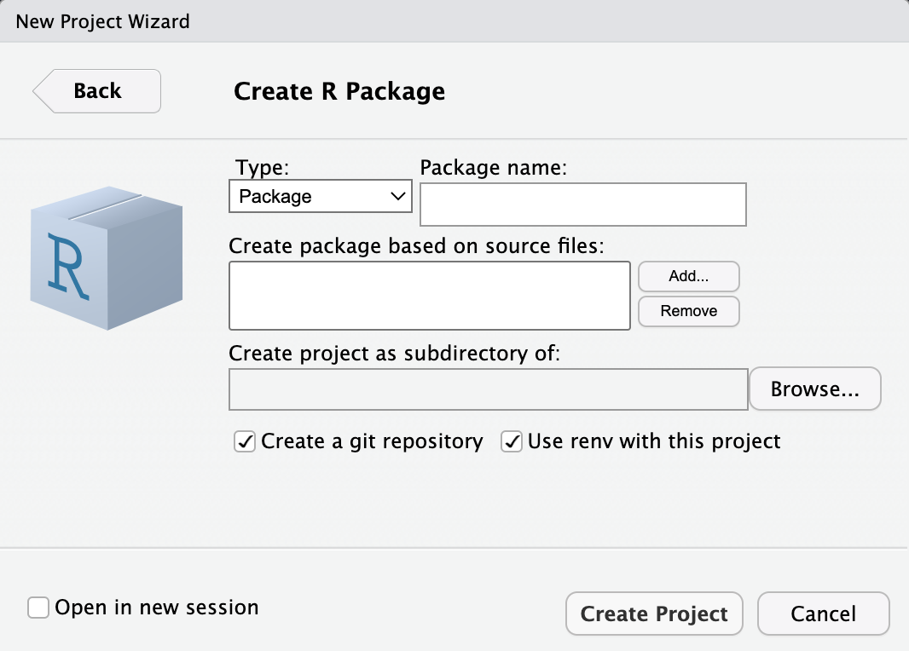

<!-- README.md is generated from README.Rmd. Please edit that file -->

# `shiny-app-setups`

<!-- badges: start -->
<!-- badges: end -->

`shiny-app-setups` contains setups for 1) R packages, 2) `golem` shiny
apps, and 3) a `rhino` apps.

All projects were created in the RStudio IDE (with the default options
selected).

## R App (as a package)

From the console, packages are built using `devtools` and `usethis`.

The function for building a new package is `usethis::create_package()`

``` r
install.packages("devtools")
library(devtools)
Loading required package: usethis
usethis::create_package(path = "myPkgApp")
```

When creating a new package in the IDE, I provide a name and the parent
folder. New R packages use `roxygen2` (`roxygen = TRUE`) and check the
package name (`check_name = TRUE`), and default to using `renv` and
create a git repo.



### Folder structure

<!-- tree myRPkg -L 5 -->

``` bash
myPkgApp/
  ├── DESCRIPTION
  ├── NAMESPACE
  ├── R
  │   └── hello.R
  ├── man
  │   └── hello.Rd
  ├── myRPkg.Rproj
  └── renv
      ├── activate.R
      ├── sandbox
      │   └── R-4.2
      │       └── x86_64-apple-darwin17.0
      │           └── 84ba8b13
      └── settings.dcf

8 directories, 7 files
```

### `DESCRIPTION` file

    Package: myPkgApp
    Title: What the Package Does (One Line, Title Case)
    Version: 0.0.0.9000
    Authors@R: 
        person("First", "Last", , "first.last@example.com", role = c("aut", "cre"),
               comment = c(ORCID = "YOUR-ORCID-ID"))
    Description: What the package does (one paragraph).
    License: `use_mit_license()`, `use_gpl3_license()` or friends to pick a
        license
    Encoding: UTF-8
    Roxygen: list(markdown = TRUE)
    RoxygenNote: 7.2.3

## `golem` projects

From the console, `golem` apps are also packages and are built using
`golem::create_golem()`:

``` r
install.packages("golem")
library(golem)
golem::create_golem(path = "myGolemApp")
```

When creating a new `golem` package in the IDE, I provide the name and
the parent folder.

New `golem` packages automatically perform a check on the name of the
package (`check_name = TRUE`).



### Folder structure

<!-- tree myGolemApp -L 5 -->

``` bash
myGolemApp
    ├── DESCRIPTION
    ├── NAMESPACE
    ├── R
    │   ├── app_config.R
    │   ├── app_server.R
    │   ├── app_ui.R
    │   └── run_app.R
    ├── dev
    │   ├── 01_start.R
    │   ├── 02_dev.R
    │   ├── 03_deploy.R
    │   └── run_dev.R
    ├── inst
    │   ├── app
    │   │   └── www
    │   │       └── favicon.ico
    │   └── golem-config.yml
    ├── man
    │   └── run_app.Rd
    ├── myGolemApp.Rproj
    ├── renv
    │   ├── activate.R
    │   ├── sandbox
    │   │   └── R-4.2
    │   │       └── x86_64-apple-darwin17.0
    │   │           └── 84ba8b13
    │   └── settings.dcf
    └── renv.lock

12 directories, 17 files
```

### `DESCRIPTION` file

    Package: myGolemApp
    Title: An Amazing Shiny App
    Version: 0.0.0.9000
    Authors@R: 
        person(given = "firstname",
               family = "lastname",
               role = c("aut", "cre"),
               email = "your@email.com")
    Description: What the package does (one paragraph).
    License: What license is it under?
    Imports: 
        config (>= 0.3.1),
        golem (>= 0.3.5),
        shiny (>= 1.7.4)
    Encoding: UTF-8
    LazyData: true
    RoxygenNote: 7.1.1

## `rhino` projects

From the console, `rhino` apps not packages (they use
[`box`](https://klmr.me/box/)), and are built using `rhino::init()`:

``` r
install.packages("rhino")
library(rhino)
rhino::init(dir = "myRhinoApp")
```

When creating a new `rhino` package in the IDE, I provide the name and
the parent folder.

New `rhino` packages automatically create GitHub Actions Continuous
Integration (`github_actions_ci = TRUE`).



### Folder structure

``` bash
myRhinoApp
    ├── app
    │   ├── js
    │   │   └── index.js
    │   ├── logic
    │   │   └── __init__.R
    │   ├── main.R
    │   ├── static
    │   │   └── favicon.ico
    │   ├── styles
    │   │   └── main.scss
    │   └── view
    │       └── __init__.R
    ├── app.R
    ├── config.yml
    ├── dependencies.R
    ├── myRhinoApp.Rproj
    ├── renv
    │   ├── activate.R
    │   ├── library
    │   │   └── R-4.2
    │   │       └── x86_64-apple-darwin17.0
    │   ├── sandbox
    │   │   └── R-4.2
    │   │       └── x86_64-apple-darwin17.0
    │   └── settings.dcf
    ├── renv.lock
    ├── rhino.yml
    └── tests
        ├── cypress
        │   └── integration
        │       └── app.spec.js
        ├── cypress.json
        └── testthat
            └── test-main.R

18 directories, 17 files
```

### `config.yml` file

    default:
      rhino_log_level: !expr Sys.getenv("RHINO_LOG_LEVEL", "INFO")
      rhino_log_file: !expr Sys.getenv("RHINO_LOG_FILE", NA)

### `rhino.yml` file

    sass: node

## `leprechaun` projects

`leprechaun` apps are built using the same methods as R packages
(`devtools` and `usethis`).

``` r
usethis::create_package("myLeprechaunApp")
```

After the new project opens, install and load the `leprechaun` package,
then run `leprechaun::scaffold()`:

``` r
install.packages("leprechaun")
library(leprechaun)
leprechaun::scaffold()
```

When creating a new `leprechaun` package in the IDE, it’s identical to
the R package setup.


